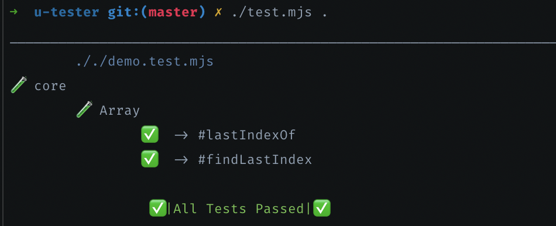

# unit-tester
A simple framework for unit tests

# Premise

This is a simple library for very simple and limited unit testing.

I had to write it I was taking a bus for 6 hours and had no internet to add Mocha to this project.

#### Output example:




# Installation
```
~$ npm i unit-tester --save-dev
```

# Usage Notes

```
~$ mkdir tests
~$ touch tests/something.test.mjs
~$ edit tests/something.test.mjs
```

```js
import assert from "node:assert"
import { Tests, Test } from "unit-tester"
export default [
  Tests("Array",
    Test("#indexOf", () => {
      assert.equal([1, 2, 3, 6].indexOf(6), 3)
    }),
    Test("#filter", () => {
      assert.deepEqual([1, 2, 3, 6].filter(n => n % 2), [1, 3])
    })
  )
]
```

```
~$ node_modules/u-tester/test.mjs test
```

#### Pro tip:

Add this command `"test": "node_modules/u-tester/test.mjs test"` to `"scripts"` section in your `package.json`.

Now you can use `~$ npm test` to test. Also you can replace the `test` folder with whatever folter name suits you best.


## Managing and writing tests

All tests must be in files with `.test.` in their name e.g. `router.test.mjs`

All files should be in a folder provided in the command e.g. `node_modules/u-tester/test.mjs test`

The Tester will read all such files in the designated folder and run the tests automatially.

The `.test.` files should export a single array of tests or test groups.

Test groups have names, can be nested as many times as needed, and can accept as many tests or test groups as needed.

Tests have names, test function, and can be `async` if needed.
